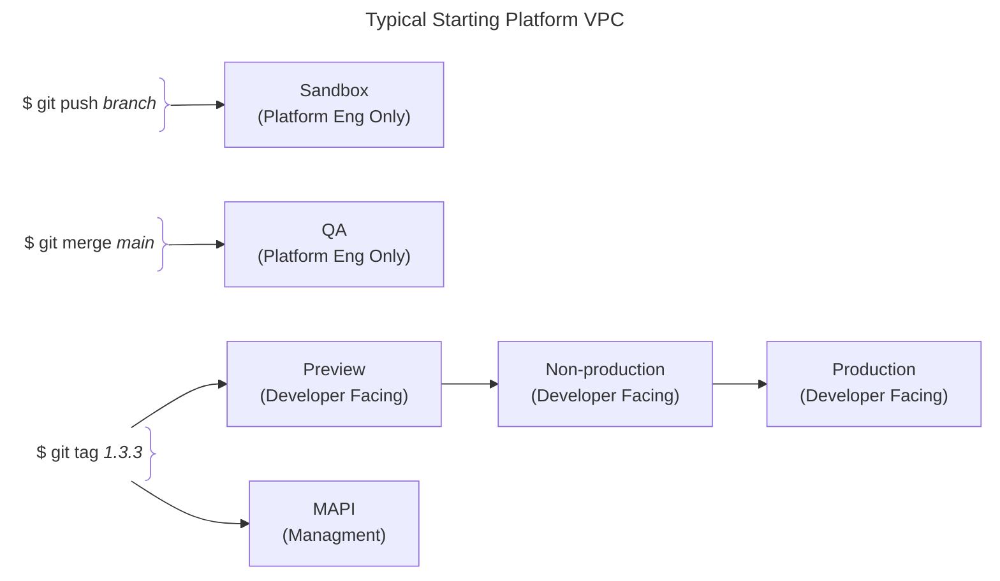
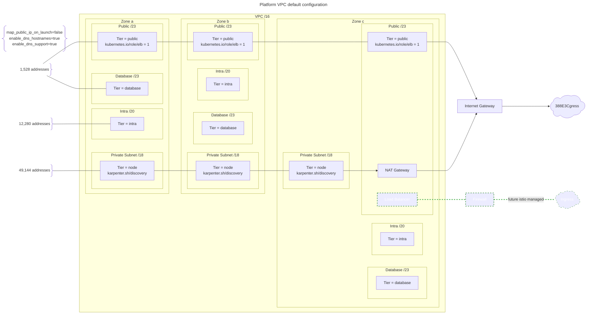
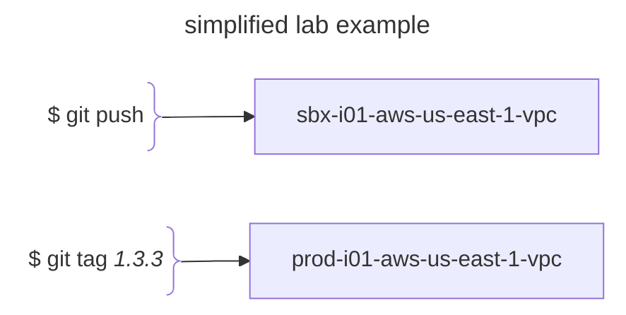

	

	 
	 
	<h2>psk-aws-platform-vpc</h2>
	 
	

While the PSK lab only makes use of two vpcs, a typical multi-region Engineering Platform would have many more.  

The orchestration follows the control plane cluster release path to production.  

Also, note that having multiple cluster in multiple regions as part of the same role requires a more complex network configuration. For cost purposes, our live lab environment does not make use of either multi-region clusters nor networks. See the psk-aws-platform-wan repo and inline comments in this repo for examples of such a configuration.  

## psk lab reservations and release pipeline
| vpc                     | region          | az                | az                | az                | total IPs |
|-------------------------|:---------------:|:-----------------:|:-----------------:|:-----------------:|:---------:|
|                         |                 |                   |                   |                   |           |
| dps-2                   | us-east-1       | us-east-1a        |   us-east-1b      |  us-east-1c       |           |
| sbx-i01-aws-us-east-1   | 10.90.0.0/16    |                   |                   |                   |           |
| private  (nodes)        |                 | 10.80.0.0/18      | 10.80.64.0/18     | 10.80.128.0/18    | 49,146    |
| intra*       |                 | 10.80.192.0/20    | 10.80.208.0/20    | 10.80.224.0/20    | 12,282    |
| database                |                 | 10.80.240.0/23    | 10.80.242.0/23    | 10.80.244.0/23    | 1,530     |
| public   (ingress)      |                 | 10.80.246.0/23    | 10.80.248.0/23    | 10.80.250.0/23    | 1,530     |
|                         |                 |                   |                   | unallocated addr  | 1047      |
|                         |                 |                   |                   |                   |           |
| dps-1                   | us-east-2       | us-east-2a        |   us-east-2b      |  us-east-2c       |           |
| prod-i01-aws-us-east-1  | 10.90.0.0/16    |                   |                   |                   |           |
| private (nodes)         |                 | 10.90.0.0/18      | 10.90.64.0/18     | 10.90.128.0/18    | 49,146    |
| intra*       |                 | 10.90.192.0/20    | 10.90.208.0/20    | 10.90.224.0/20    | 12,282    |
| database                |                 | 10.90.240.0/23    | 10.90.242.0/23    | 10.90.244.0/23    | 1,530     |
| public   (ingress)      |                 | 10.90.246.0/23    | 10.90.248.0/23    | 10.90.250.0/23    | 1,530     |
|                         |                 |                   |                   | unallocated addr  | 1047      |

*private subnet with no internet routing (in the sense of RFC1918 Category 1), commonly used for Lambda functions ENI allocations.

Maintainer notes found [here](doc/maintainer_notes.md).
